::: {.columnal .top-banner}
facebook.com/hellomsg

#omgmsg
:::

::: {.columnal .bottom-banner}
* sarah
* sarahlohman.com
* @fourpoundsflour

&nbsp;

* soma
* brooklynbrainery.com
* @dangerscarf
:::

::: {.sarah-book}

:::

::: {.image-tall}
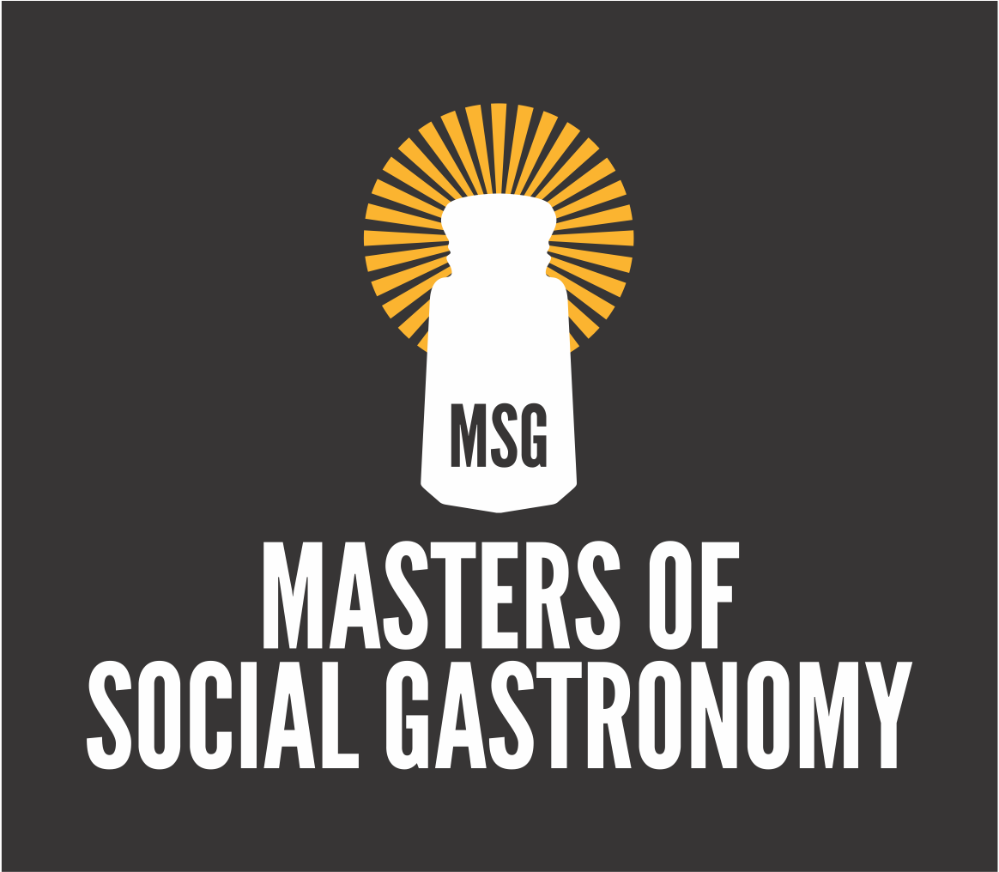
:::

---

## Storytime

**Appliance hunting!**

---

# {data-background-image="images/kitchen.jpg"}

---

# {data-background-image="images/future-kitchen.jpg"}

---

# {data-background-image="images/knock.gif"}

**Knock-to-see**

---

# {data-background-image="images/family-hub.jpg"}

**Weird interactive stuff**

---

# {data-background-image="images/iphone.gif"}

---

## Ethylene scrubbers: **love you**

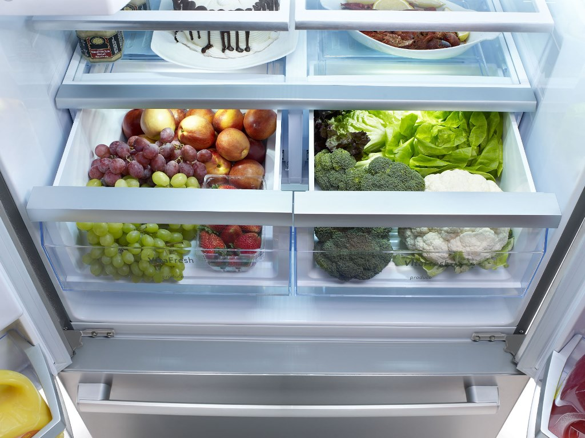

---

## Speed ovens: **you're okay**

---

## Built-in probes: **you're okay**

---

## June Smart Oven: **a hot mess**

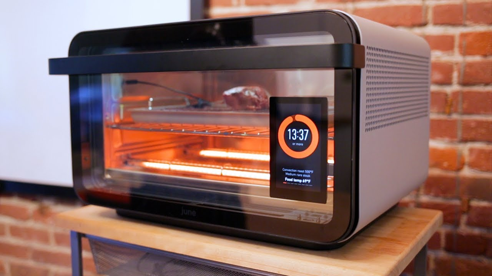

---

# {data-background-image="images/june-camera.jpg"}

---

## Open burners: **marry me**

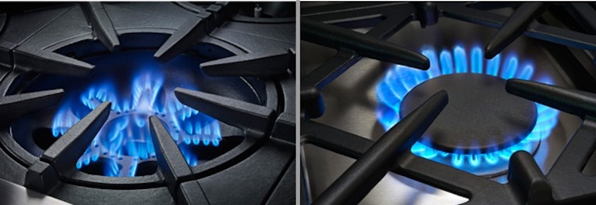

---

## Smart hood: **What the fuck?**

---

# {data-background-image="images/craigslist.png"}

---

What is the number one problem with kitchen appliances?

**?????**

---

What is the number one problem with kitchen appliances?

**wives**

---

::: {.image-tall}
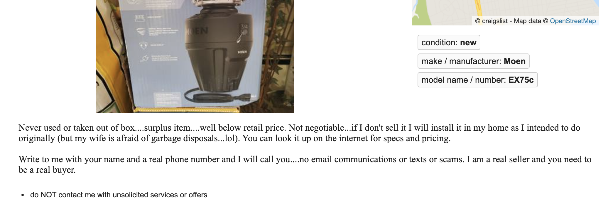
:::

---

::: {.image-tall}
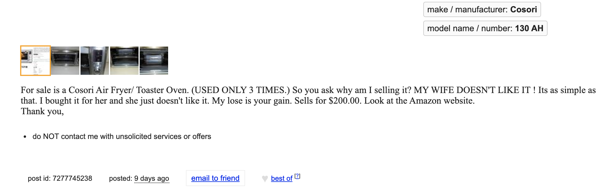
:::

---

::: {.image-tall}
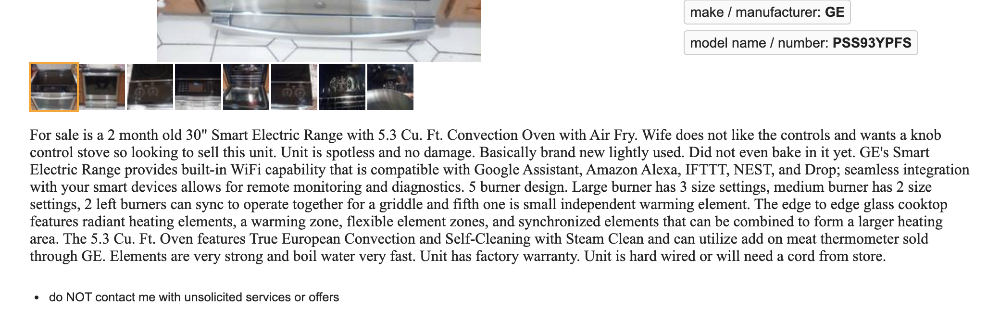
:::

---

::: {.image-tall}

:::

---

# *fin*

---

::: {.columnal .top-banner}
facebook.com/hellomsg

#omgmsg
:::

::: {.columnal .bottom-banner}
* sarah
* sarahlohman.com
* @fourpoundsflour

&nbsp;

* soma
* brooklynbrainery.com
* @dangerscarf
:::

::: {.sarah-book}

:::

::: {.image-tall}

:::

---

# Our Future in Food {data-background-image="images/fridge-dark.jpg"}

---

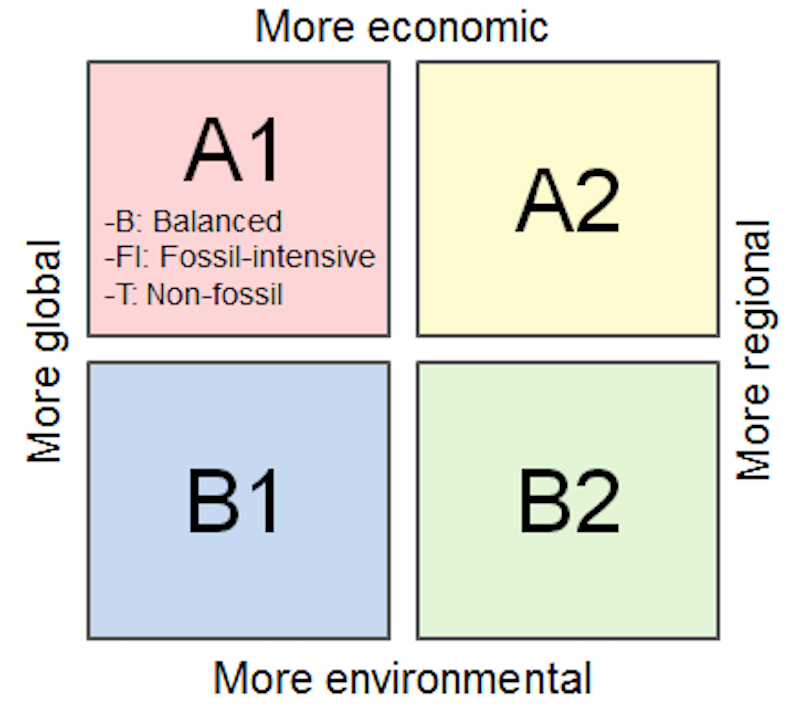

**Intergovernmental Panel on Climate Change**

::: notes
Aligned on two axes:

* economy vs environment
* globalization vs regionalization

Based on Intergovernmental Panel on Climate Change (IPCC)

For example, people are gonna eat everything

* cereals
* oils
* roots and tubers
* sugar
* meat
* milk and eggs

But changes based on the world.
:::

---

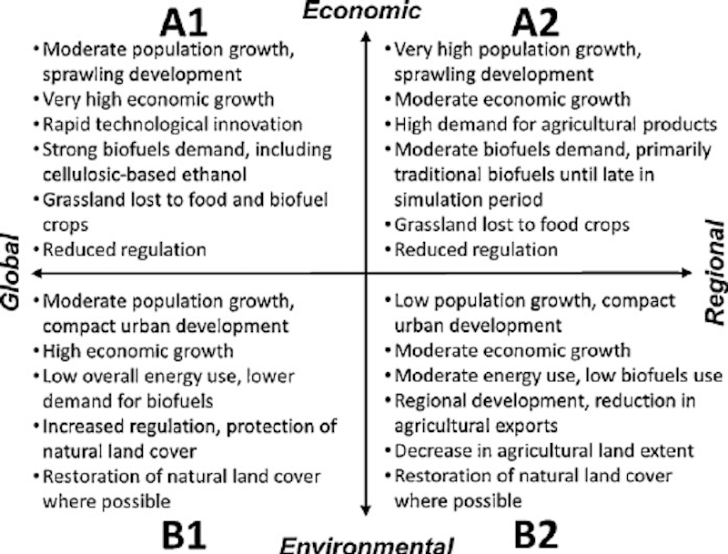

---

## Four views of the future

::: {.right-image}
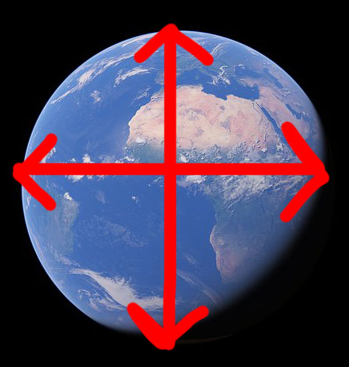
:::

* **A1** Affluent world 🤖
* **A2** Full world 🤼
* **B1** Vegetarian world 🥒
* **B2** Low-Input world 🛏️
* *from "The future of food — Scenarios and the effect on natural resource use in agriculture in 2050" by I.Y.R. Odegard, E. van der Voet*

---

## Virtual resource content

**Land** +  **Water** + **Fertilizer**

::: notes
How much stuff is needed to produce
:::
---

# {data-background-image="images/land-use.jpg"}

## Attainable yield 

*What has technology done for you recently?*

**Optimistic:** 80% 

**Pessismitic:** 20%

::: notes
Virtual land content

Maximum attainable yield

"Yield gap" is the difference between current and maximum

Optimistic - 80% closed. Pessimistic - 20% closed.
:::
---

# {data-background-image="images/wave.jpg"}

## Water water everywhere 

Cucumber: 42 gallons/lb

Lentils: 704

Beef: 1,800

Almonds: 1,900

::: notes
Virtual water content
:::

---

## Fertilizer

**Nitrogen** + **Phosphorus** + **Potassium**

::: notes
Based on the soil you're growing in

Government subsidies

Not something we ever think about, but...
:::
---

## 🤖 The Affluent World 🤖

**economy** over environment, **global** over regional

* **Population growth:** Low - 7.78b
* **Economic development:** High - ~$30k
* **Tech:** High + global
* **Diet:** Western
* **Animal-based foods:** 26% of diet
* **Household waste:** Same as USA in 1995
* **Feedcrop yields:** High
* **Foodcrop productivity:** 80% closure of yield gap

---

## 🤼 The Full World 🤼

**economy** over environment, **regional** over global

* **Population growth:** High - 9.9b
* **Economic development:** Low - ~$10k
* **Tech:** Slow + regional
* **Diet:** Western
* **Animal-based foods:** 22% of diet
* **Household waste:** Half of USA in 1995
* **Feedcrop yields:** Varied, some higher
* **Foodcrop productivity:** 20% closure of yield gap

---

## 🥒 The Vegetarian World 🥒

**environment** over economy, **global** over regional

* **Population growth:** Low - 7.78b
* **Economic development:** Med-High - ~$20k
* **Tech:** medium + global
* **Diet:** Vegetarian
* **Animal-based foods:** 9% of diet
* **Household waste:** Half of USA in 1995
* **Feedcrop yields:** Average
* **Foodcrop productivity:** 80% closure of yield gap

---

## 🛏️ The Low-Input World 🛏️

**environment** over economy, **regional** over global

* **Population growth:** Medium - 9.15b
* **Economic development:** Medium - ~$15k
* **Tech:** medium + regional
* **Diet:** Reduced meat
* **Animal-based foods:** 17% of diet
* **Household waste:** Half of USA in 1995
* **Feedcrop yields:** Average
* **Foodcrop productivity:** 10% closure of yield gap

---

## Change ourselves or change the world?

**Can we/do we technologize ourselves out of our problems?**

---

## How much stuff?

::: notes
* A1 is Affluent world
* A2 is Full world
* B1 is Vegetarian world
* B2 is Low-input world
* Env. worlds are second two, less stuff bc fewer animals
:::

---

## Land in 2050

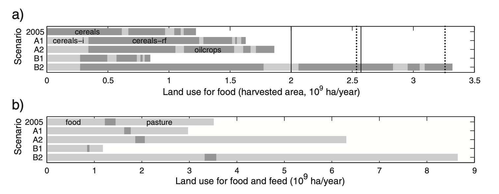

::: notes

* Foodcrops for people
* Feedcrops for animals
* Meat consump + feeding efficiency + yield
* A2, full world, didn't close that yield gap, lots of ppl eating meat
* B1, veg world, is awesome, bc 9% meat cals + yield gap closure
* B2, low input world, sucks bc bc reduced meat but awful yield
:::

---

## Water in 2050

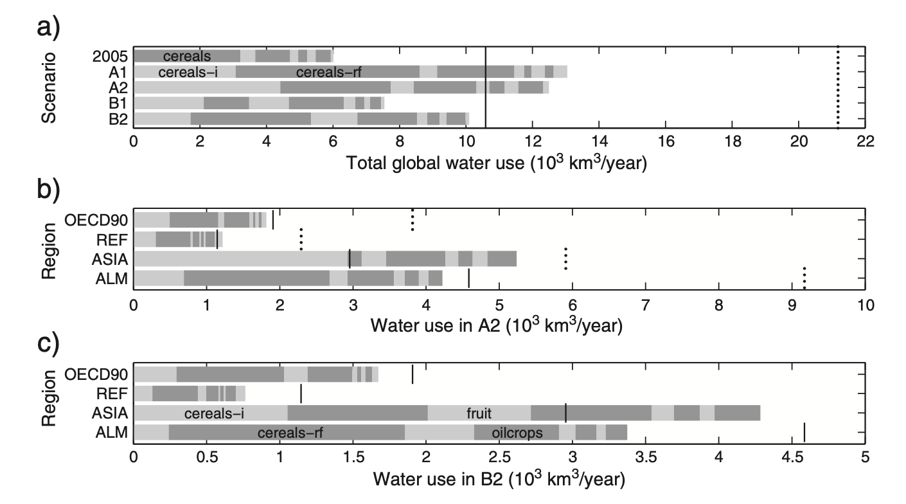

::: notes
* Animals drinking water doesn't matter
* Solid lines mean stress
* Doesn't take into account regional differences in water avail
* Asia is fucked because it loves irrigated cereals like rice
* Climate is fucked
:::
---

## Fertilizer in 2050 (and beyond)

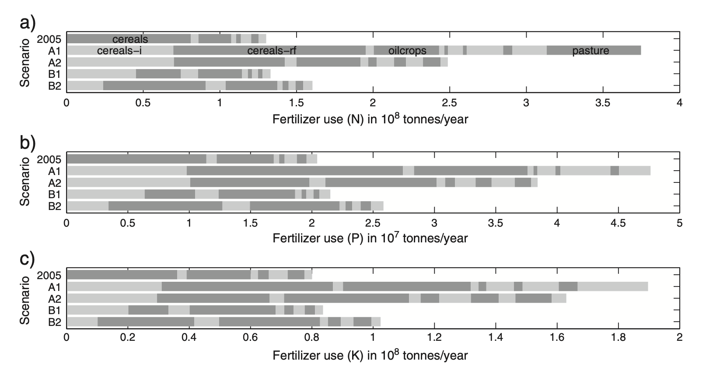

::: notes
* Tech world didn't use as much land, but makes up in fertilizer
* Veg world doesn't grow as much so doesn't use much fertilizer
:::
---

## Phosphorus crisis?

::: notes
Years of fertilizer left

Potassium and Phosphorus have a limited supply
:::
---

## We are fucked

* **🤖 Affluent world** water use, fertilizer use
* **🤼 Full world** water use, fertilizer use
* **🥒 Vegetarian world** life is perfect
* **🛏️ Low-input world** land use

---

## 2014 vs 2021

Animal-free **everythings**

---

# Precision fermentation {data-background-image="images/microbes.jpg"}

---

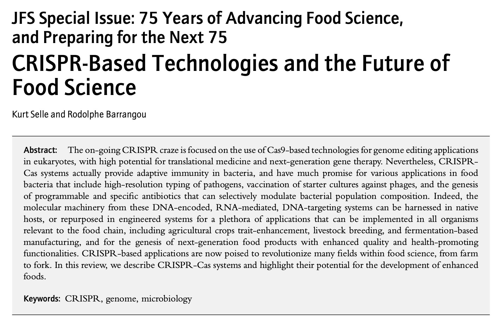

---

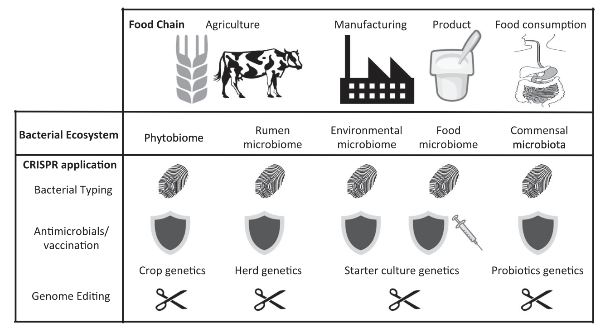

---

# {data-background-image="images/fermentation-tanks.jpg"}

## Precision fermentation

* We can produce...
* **collagen** and
* **gelatin** and
* **egg protein** and
* **heme protein** and
* **milk protein** and
* **human breast milk protein** and so much more!

**"By 2030, the US dairy and cattle industry will have collapsed"**

::: notes
vitamin production - $1m/kilo in 2000, $100/kilo today

Industrial livestock is as efficient as it's going to get - "invent a car, not an improved horse"

Milk is easiest, steak is incredibly tough but everything will collapse before then
:::

---

## By 2030

::: {.right-image}
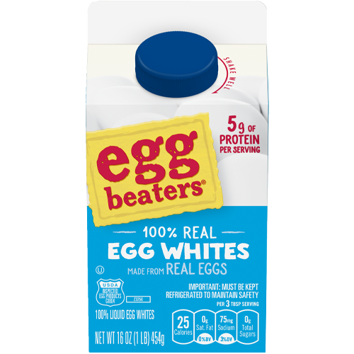
:::

* Mass-produced protein destroys "real" protein
* **Ground beef:** 70% decline
* **Steak:** 30% decline
* **Dairy:** 90% decline
* **Crop farming:** 50% decline
* *By 2035, 60% of livestock + feed production land will be freed up*

::: notes
Probably won't happen, but!!! switch from small scale to industrial farms happened in a generation
:::
---

# {data-background-image="images/vegan.jpg"}

**"This report would have you believe that in 11 short years we will be living in The Jetsons, with consumers massively adopting industrially developed, untested food-like products on their way to vegan fantasyland. In reality, US dairy is part of the sustainability solution: our greenhouse-gas emissions have fallen in absolute terms since 2005, and we have committed to further reductions."**

* **- National Milk Producers Federation** 
* ***(North American Meat Institute did not respond to requests for comment)***

---

## Everything will go insane

More on the vegan fantasyland paper at **rethinkx.com **

---

#  {data-background-image="images/land-use.jpg"}

## Lessons learned 

**Invest in yeast futures**

**Hug a chicken**

**We're fucked**

---

::: {.columnal .top-banner}
facebook.com/hellomsg

#omgmsg
:::

::: {.columnal .bottom-banner}
* sarah
* sarahlohman.com
* @fourpoundsflour

&nbsp;

* soma
* brooklynbrainery.com
* @dangerscarf
:::

::: {.sarah-book}

:::

::: {.image-tall}

:::

---